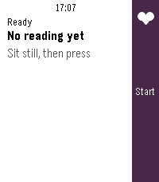
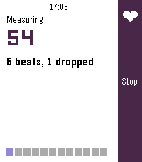
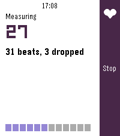
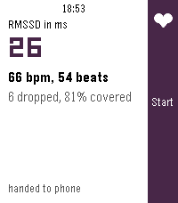
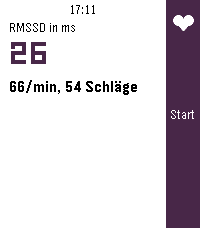
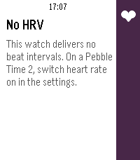

# Herzintervall

Herzratenvariabilität auf der Uhr messen: eine Minute ruhig sitzen, am Ende
steht der **RMSSD** in Millisekunden da.

Die Oberfläche folgt der **Sprache der Uhr** (Deutsch und Englisch, Englisch als
Rückfall) und dem Timeline-Look der Schwesterapps: weisser Grund, schwarze
Schrift, dunkle Seitenleiste rechts.

> **Nur Pebble Time 2.** Keine andere Uhr liefert Schlagintervalle — und der
> Emulator auch nicht. Mehr dazu unter [Was die Uhr hergibt](#was-die-uhr-hergibt).

## Screenshots

| | | |
|---|---|---|
|  |  |  |
| bereit | Messung beginnt | Messung, Balken halb |
|  |  |  |
| Ergebnis | dasselbe auf Deutsch | Uhr ohne HRV |

## Bedienung

Ein Bildschirm, eine Taste.

| Taste | Aktion |
|---|---|
| Mitte | Messung starten, nochmal drücken bricht ab |
| Unten | Testwert ans Telefon schicken (nur zum Prüfen der Übergabe) |
| Zurück | App verlassen |

Vier Zustände: **bereit** (der letzte Wert steht da), **Messung läuft**
(Restsekunden gross, darunter gezählte und verworfene Schläge, unten ein
Balken), **Ergebnis** (RMSSD gross, darunter mittlerer Puls und Anzahl, und eine Zeile
zur Güte der Messung) und **kein HRV**, wenn die Uhr keine Intervalle liefert.

Die Gütezeile nennt **verworfene Schläge** und **Deckung** — wie viel der Minute
die angenommenen Intervalle zusammen ausfüllen. Bleibt viel übrig, fehlen
Schläge: entweder weil der Filter sie verworfen hat oder weil der Sensor sie nie
gemeldet hat. Die beiden Zahlen nebeneinander sagen, welches von beidem.

Der letzte Wert überlebt das Beenden und steht auch im App-Glance des Starters.

## Nachts um fünf

Die App misst **jede Nacht um 5 Uhr von selbst, drei Minuten lang**. Dafür ist
nichts einzustellen; der Wecker stellt sich bei jedem Start neu und übersteht so
Neustarts und Zeitumstellungen.

HRV im Schlaf ist der Wert, den auch Garmin, Whoop und Oura ausweisen: er hängt
weniger an Haltung, Atmung und Tagesform als eine wache Minute im Sitzen, und
drei Minuten liefern deutlich mehr Intervallpaare als eine. Genau das macht den
Wert von Tag zu Tag vergleichbar — was bei HRV das einzige ist, was zählt.

**Der Schirm geht dabei kurz an.** Ein Pebble-Wakeup startet die App im
Vordergrund; einen stillen Hintergrundlauf gibt es nicht (der Worker-Prozess
käme zwar an den Sensor, aber nicht an AppMessage). Nach der Messung schliesst
sich die App von selbst wieder.

War die Uhr um fünf aus, wird die Messung beim Einschalten nachgeholt
(`notify_if_missed`) — lieber eine verspätete als gar keine.

Geprüft mit `tools/test_night.sh`: Wecker in einer Minute statt um fünf, Messung
20 s statt 180. Der Emulator zeigt den ganzen Weg — App verlassen, Wecker
öffnet sie wieder, Messung läuft, Ergebnis geht ans Telefon, App schliesst sich,
Uhr zurück auf dem Zifferblatt.

## Was gemessen wird

**RMSSD** — die Wurzel aus dem Mittel der quadrierten Unterschiede
aufeinanderfolgender Schlagintervalle. Von den gängigen HRV-Kennzahlen ist sie
die, die schon aus einer Minute etwas Belastbares macht.

Gerechnet wird in ganzen Zahlen, mit eigener Quadratwurzel: die Uhr hat keine
Fliesskomma-Einheit.

### Warum gefiltert wird

Die Uhr liefert jedes Intervall einzeln, aber **ohne seine Güte**. Der
Health-Handler bekommt nur den Ereignistyp, und die Struktur mit dem
Konfidenzwert ist in der Firmware als `@internal` markiert — für Apps
unsichtbar. Ein verschluckter oder doppelt gezählter Herzschlag ist dem Wert
also nicht anzusehen, und genau darauf reagiert RMSSD heftiger als auf alles
andere.

Deshalb sortiert `src/c/hrv_math.c` statistisch aus:

1. **Fenster 300–2000 ms** (200 bis 30 Schläge/min). Alles ausserhalb ist kein
   Herzschlag, sondern ein Messfehler.
2. **Höchstens 20 % Sprung** zum vorigen angenommenen Intervall. Echte
   Schlag-zu-Schlag-Schwankung bleibt darunter, ein ausgelassener Schlag
   (fast doppelte Länge) liegt darüber.
3. **Differenzen nur über ununterbrochene Paare.** Wurde dazwischen etwas
   verworfen, fehlt ein Schlag — eine Differenz über die Lücke hinweg wäre
   erfunden.
4. **Nach drei verworfenen in Folge wird neu angesetzt.** Ohne das bliebe der
   Filter hängen, sobald der Puls schnell steigt: er vergliche ewig gegen einen
   alten Wert und verwürfe jeden neuen.

Unter fünf brauchbaren Differenzen wird kein Wert angezeigt, sondern «zu wenig
saubere Schläge».

## Was die Uhr hergibt

Seit Firmware 4.32 gibt es die HRV-API, und die SDK 4.33.1 hat sie bereits.
Drei Dinge sind dabei wichtig:

- **Nur auf der Pebble Time 2.** `CONFIG_HRM_HRV` steht in PebbleOS allein im
  Board `obelix`. `asterix` (Pebble 2 Duo) und `getafix` (Pebble Round 2) haben
  gar keinen Herzsensor, und `qemu_emery` hat `CONFIG_HRM` **ohne** HRV.
- **Die Header liegen für alle Plattformen bereit.** Eine HRV-App baut deshalb
  auch für flint und gabbro anstandslos durch und tut dort zur Laufzeit nichts.
  `health_service_set_hrv_sample_period()` muss auf `false` geprüft werden —
  sonst sucht man den Fehler an der falschen Stelle. Genau das führt hier zum
  Bildschirm «kein HRV».
- **Nichts wird gespeichert.** HRV taucht in der Health-Datenbank nicht auf. Es
  wird nur gesammelt, solange diese App läuft und den Sensor angefordert hat.
  Beim Beenden gibt sie ihn wieder frei — sonst liefe er weiter und kostete
  Batterie.

Ausserhalb des Handgelenks meldet die Firmware ein Intervall 0, also dasselbe
wie «noch nichts gemessen». Beides ist von aussen nicht unterscheidbar.

## Bauen

Pebble waf verträgt keine Pfade mit Leerzeichen, deshalb wird in WSL unter
`~/herzintervall` gebaut:

```sh
tools/sync_herzintervall.sh <Quellordner>   # spiegeln + bauen
pebble install --emulator emery
pebble install --phone <IP>                 # Developer Connection der Pebble-App
```

Die App zielt nur auf **emery** (Pebble Time 2). Andere Plattformen im
Appstore anzubieten hiesse, eine App auszuliefern, die dort nichts tun kann.

## Prüfen

```sh
sh tools/selftest.sh <Quellordner>    # die Rechnung, auf der Zielarchitektur
sh tools/screens.sh <Quellordner>     # alle Bildschirme fotografieren
sh tools/screens_de.sh <Quellordner>  # dieselben auf Deutsch
node tools/strings_check.js src/c/strings_table.h
```

**Warum der Selbsttest im Emulator läuft und nicht hier:** auf dem Baurechner
steht kein C-Compiler — kein gcc, und ohne Passwort kein `apt`. Nur der
ARM-Compiler der SDK ist da. Ein Test, der nie läuft, ist keiner; also läuft er
dort, wo ohnehin übersetzt wird. Das prüft nebenbei mehr als ein Lauf auf
x86-64, weil Typbreiten und Ausrichtung dann nachweislich auf 32-Bit-ARM
stimmen.

Die Erwartungswerte sind **vorher unabhängig bestimmt** (Lehrbuchformel in
Fliesskomma) und als Konstanten eingetragen. Ein Test, der seine Erwartung aus
demselben Code zieht, den er prüft, bestätigt nur sich selbst.

`screens.sh` läuft zweimal: einmal gewöhnlich — der Emulator hat kein HRV, das
zeigt also den echten Fehlerweg ungetrickst — und einmal mit
`-DHZ_FAKE_BEATS`, damit sich Messung und Ergebnis überhaupt ansehen lassen.
Gezeichnet und gerechnet wird dabei dasselbe wie im Betrieb; nur die Herkunft
der Zahlen ist gefälscht.

## Auf der Uhr

Erste Messung auf einer echten Pebble Time 2 (0.1.0): **RMSSD 37 ms, 74/min,
61 Schläge**. Die Zahlen sind untereinander stimmig — 61 Schläge zu je rund
811 ms decken etwa 49,5 der 60 Sekunden ab, die Kette ist also zu gut vier
Fünfteln lückenlos. Der Sensor liefert, der Filter lässt das meiste durch, und
der RMSSD stammt aus echten aufeinanderfolgenden Paaren.

Damit ist belegt, dass die Kette trägt. **Nicht** belegt ist, ob 37 ms richtig
sind — dazu bräuchte es einen Brustgurt als Referenz.

Aus diesem Lauf kam die Gütezeile in 0.2.0: die Zahl der verworfenen Intervalle
stand nur während der Messung da und fehlte ausgerechnet im Ergebnis, wo man sie
braucht.

## Was weiterhin ungeprüft ist

- die **Genauigkeit** gegen eine Referenzmessung
- ob ein Ereignis verlorengeht, wenn zwei Intervalle dicht aufeinander folgen.
  `health_service_peek_hrv_ppi_ms()` liefert immer nur das letzte; kommt ein
  zweites, bevor der Handler läuft, ist das erste weg. Mit der öffentlichen API
  ist das nicht zu umgehen und von aussen auch nicht zu messen — die Deckung in
  der Gütezeile ist der beste Anhaltspunkt, den es dafür gibt.
- ob der 20-%-Filter bei starkem PPG-Rauschen zu streng ist. Liegt die Deckung
  dauerhaft niedrig bei gleichzeitig wenigen verworfenen, liefert der Sensor zu
  wenig; sind viele verworfen, ist der Filter zu eng.

## Health Connect

Jede brauchbare Messung geht per AppMessage ans Telefon, und die
Companion-App unter `companion/` trägt sie in **Health Connect** ein. Dort gibt
es `HeartRateVariabilityRmssdRecord` — RMSSD in Millisekunden, also genau das,
was die Uhr misst. Nichts umzurechnen, nichts in ein fremdes Feld zu biegen.

Eingetragen wird der Zeitpunkt der **Messung**, nicht der des Empfangs. Sonst
stünden die Werte in der Akte um die Laufzeit der Übertragung verschoben.

Messungen mit zu wenig sauberen Schlägen gehen gar nicht erst hinaus — die
gehören in keine Gesundheitsakte.

### Warum eine eigene App und nicht die Telefonseite

PebbleKit JS kann nur HTTP sprechen und kommt an Health Connect nicht heran.
Der einzige Zugang ist eine native Android-App. Und beides zugleich geht nicht:

> PebbleKit JS cannot be used in conjunction with PebbleKit Android or
> PebbleKit iOS.

Deshalb hat Herzintervall **bewusst kein `src/pkjs/index.js`**. Läge eines im
Projekt, gingen die Nachrichten dorthin und kämen bei der Companion-App nie an.

Die gute Nachricht: die klassische PebbleKit-Schnittstelle läuft über
gewöhnliche Broadcast-Intents (`com.getpebble.action.app.RECEIVE` mit `uuid`,
`transaction_id` und `msg_data` als JSON). Die Companion-App braucht damit
**keine einzige Pebble-Abhängigkeit** — ein Empfänger, ein JSON-Parser, ein
Schreibzugriff. Nachgesehen in `coredevices/mobileapp`, `PebbleKitClassic.kt`.

**Und in `package.json` darf KEIN `companionApp` stehen.** Das klingt verkehrt
herum. `CompanionAppLifecycleManager.android.kt` entscheidet danach:

```kotlin
val hasAnyPebbleKit2CompanionApps =
    appInfo.companionApp?.android?.apps?.any { it.pkg != null } == true
return if (hasAnyPebbleKit2CompanionApps) PebbleKit2(...) else PebbleKitClassic(...)
```

Ein Paketname dort schaltet auf **PebbleKit2** um, und das *bindet sich an einen
Dienst* in der Companion-App, statt zu senden. Wer den klassischen Broadcast
empfängt, darf dort nicht stehen. Genau dieser Eintrag war die Ursache dafür,
dass anfangs gar nichts ankam und die Uhr `APP_MSG_SEND_TIMEOUT (2)` meldete.

### APK

Auf dem Entwicklungsrechner steht kein Android-SDK. Gebaut wird deshalb in
GitHub Actions (`.github/workflows/companion.yml`); das APK hängt am Lauf und
lässt sich von dort herunterladen und per Sideload installieren.

Nach dem Installieren: App einmal öffnen (das startet den Empfangsdienst),
Erlaubnis erteilen, dann auf der Uhr messen — oder die untere Taste drücken, die
schickt sofort einen Testwert.

**Die Signatur wechselt bei jedem CI-Lauf**, weil GitHub Actions jedes Mal einen
frischen Debug-Schlüssel erzeugt. Eine neue Fassung lässt sich deshalb nicht
über die alte installieren; vorher deinstallieren. Verloren geht dabei nichts —
der einzige Zustand der App ist die zuletzt empfangene Messung, und die steht in
Health Connect.

### Auf dem Telefon bestätigt

Die ganze Kette läuft: Uhr → Telefon → Companion → Health Connect.

Bis dahin lagen vier eigene Fehler im Weg, alle vier durch Lesen der Quelle von
`coredevices/mobileapp` gefunden — kein einziger durch Raten, und keiner wäre
mit einem Log schneller gefunden worden:

1. **Die UUID ist kein Text.** `putExtra(APP_UUID, uuid.toJavaUuid())` legt ein
   `java.util.UUID` ins Intent; `getStringExtra` liefert dafür `null`, und der
   Empfänger verwarf jede Nachricht in der ersten Zeile.
2. **`companionApp` in `package.json` schaltet den Broadcast ab.** Ein Eintrag
   dort wählt PebbleKit2, das sich an einen *Dienst* bindet statt zu senden.
3. **Der Broadcast ist implizit.** Seit Android 8 erreicht er im Manifest
   angemeldete Empfänger nicht mehr — es braucht einen zur Laufzeit
   angemeldeten, und damit einen Vordergrunddienst.
4. **Der ACK gehört auf `…app.ACK`**, nicht auf `…app.RECEIVE_ACK`. Letzteres
   ist die Gegenrichtung; dort hört niemand zu, und die Uhr lief in
   `APP_MSG_SEND_TIMEOUT (2)`.

Jeder einzelne davon hätte gereicht, damit nichts ankommt.

## Herkunft

Eigenentwicklung. Der Timeline-Look und die Bausteine (Seitenleiste,
Segmentbalken, Textmaschinerie) stammen aus den Schwesterapps Drinktervall und
Flynformer.

## Store-Symbole

Der Appstore nimmt **nichts aus der `.pbw`**. Das `menuIcon` darin ist das
Symbol im Starter der Uhr; für die Store-Liste liegen im Entwicklerportal zwei
eigene Bilder, `icon_large` und `icon_small`. Ein Watchface braucht sie nicht,
eine Watchapp schon.

Angefordert werden sie in festen Massen — gross **80×80** und **144×144**,
klein **28×28** und **48×48** —, jeweils mit `exact` in der Adresse: die Masse
werden **erzwungen, nicht eingepasst**. Etwas Nicht-Quadratisches kommt verzogen
zurück. Das grosse Symbol legt der Store ausserdem für sein Teilen-Bild durch
eine abgerundete Maske — darum eine gefüllte Kachel und keine freistehende
Linie.

In [store/](store/) liegen `icon-144.png` und `icon-48.png`:

```bash
python3 tools/make_app_icon.py --store store
```

Sie entstehen aus **derselben Formbeschreibung** wie das 25×25 der Uhr — alle
Masse gelten auf einem Raster von 25 Punkten und werden hochgerechnet. Ohne
`--store` erzeugt dasselbe Werkzeug weiterhin Punkt für Punkt das alte
`system_icon.png`; dass es das wirklich tut, ist byteweise nachgeprüft.

## Lizenz

Gemeinfrei, [CC0 1.0](LICENSE). Kopieren, ändern, verkaufen, einbauen — ohne
Bedingung, ohne Namensnennung, ohne Rückfrage.

CC0 statt der Unlicense, weil das Schweizer Urheberrecht einen Verzicht gar
nicht kennt; CC0 trägt für genau diesen Fall eine Ersatzlizenz in sich, die
dasselbe erlaubt.
